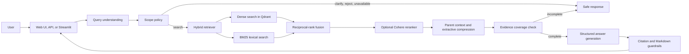
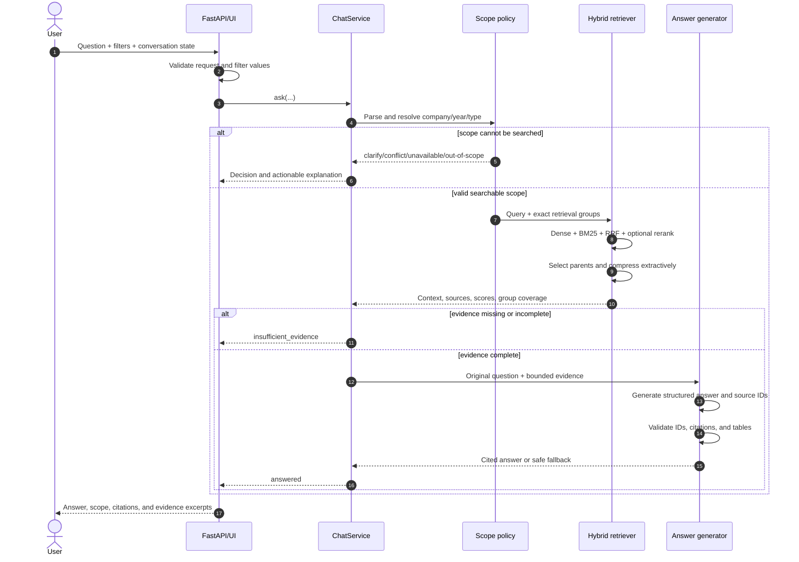
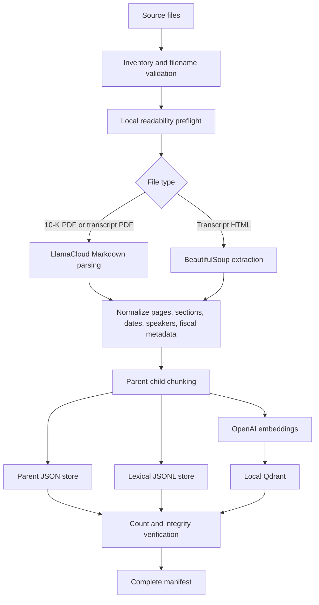

# FinRAG Analyst: Manager Presentation and Technical Walkthrough

> Audience: engineering manager, product manager, technical reviewers, and new team members  
> Project phase: Phase 1  
> Default index: `phase1-v2`  
> Last repository review: September 17, 2026

## 1. Executive summary

FinRAG Analyst is an evidence-grounded financial research assistant for a fixed
collection of SEC 10-K reports and Q4 earnings-call transcripts. A user asks a
question in natural language, and the system identifies the requested company,
fiscal year, and document type; retrieves relevant document evidence; asks an
OpenAI model to answer only from that evidence; validates the answer's citations;
and returns the answer together with inspectable source excerpts.

The important design choice is that FinRAG is deliberately bounded. It does not
pretend to know information that is not in the selected index. If the request is
ambiguous, conflicts with an active filter, asks for an unavailable document, or
has weak evidence, the system stops with an explicit decision instead of silently
guessing.

The Phase 1 system demonstrates five capabilities:

1. Reproducible ingestion of PDF and HTML financial documents.
2. Scope-aware conversations over company, year, and evidence type.
3. Hybrid semantic and keyword retrieval with comparison-group balancing.
4. Grounded answer generation with citation and Markdown validation.
5. A usable web interface and a strict FastAPI integration layer.

The default `phase1-v2` index contains eight sources: Microsoft and Tesla, fiscal
years 2024 and 2025, with one 10-K and one Q4 transcript per company-year. It
contains 150 normalized source segments, 377 parent chunks, and 1,493 searchable
child chunks.

## 2. A one-minute presentation script

> “I built FinRAG Analyst to reduce the time required to research long financial
> filings while keeping every answer tied to inspectable evidence. The user asks a
> question about a company, fiscal year, and either a 10-K or earnings transcript.
> Before searching, the system resolves that scope and checks whether the requested
> source actually exists. It then combines semantic vector search with BM25 keyword
> search, balances evidence across every side of a comparison, optionally reranks
> the candidates, and restores larger parent passages for context. The answer model
> receives only this bounded context. Its structured answer is checked for valid
> source IDs and well-formed financial tables before citations are expanded for the
> user. If any required evidence is missing, FinRAG asks for clarification or
> abstains. The current automated suite has 94 passing tests, and the saved 60-item
> end-to-end evaluation reports a 0.8108 mean across five RAGAS metrics. This is a
> strong Phase 1 research prototype, with the next priorities being broader corpus
> coverage, stronger factual evaluation, authentication, rate limiting, and
> production-scale storage.”

## 3. Problem being solved

Financial analysts frequently search documents that are hundreds of pages long.
The task is difficult for three reasons:

- The same term can occur in many unrelated sections and years.
- Exact labels, abbreviations, figures, units, speakers, and accounting qualifiers
  matter; approximate paraphrases can be misleading.
- A fluent answer is not enough. The reviewer must be able to trace a claim to the
  filing page, transcript section, or speaker evidence.

A generic chatbot can produce an answer that sounds plausible while using the wrong
company, wrong fiscal year, wrong document type, or an incomplete comparison.
FinRAG addresses that failure mode by resolving scope and checking evidence before
generation.

## 4. Scope and non-goals

### In scope

- Selected 2024-2025 10-K reports.
- Selected Q4 earnings-call transcripts.
- Microsoft (`MSFT`), Tesla (`TSLA`), and—where present in an index—JPMorgan Chase
  (`JPM`).
- Narrative summaries, risk analysis, management commentary, financial facts,
  tables, calculations supported by retrieved inputs, and cross-source comparisons.
- Web, Streamlit, and JSON API access to the same orchestration pipeline.

### Out of scope

- Live share prices, news, market feeds, and real-time information.
- Investment recommendations, price targets, or personalized financial advice.
- Sources outside the active index.
- Unsupported companies or fiscal years.
- Server-side user accounts or long-term conversation storage.
- A guarantee that generated financial conclusions are error-free.

The product should be described as a document-research assistant, not an investment
adviser or a live-market terminal.

## 5. Current corpus and index versions

| Index | Companies | Years | Document types | Sources | Parent chunks | Child chunks |
|---|---|---|---|---:|---:|---:|
| `phase1-v2` (default) | MSFT, TSLA | 2024, 2025 | 10-K, transcript | 8 | 377 | 1,493 |
| `phase1-v1` | JPM, MSFT, TSLA | 2024 | 10-K, transcript | 6 | 474 | 2,068 |

Each index is a self-contained directory with four important assets:

```text
Data/indexes/<version>/
├── qdrant/                 Dense vectors and metadata
├── parents/                Full parent passages as JSON
├── lexical_chunks.jsonl    BM25 child records
└── manifest.json           Source hashes, schema, models, counts, and coverage
```

The manifest is the source of truth for runtime coverage. The frontend catalogue is
derived from it, so the UI does not claim that a missing company-year-document
combination is available.

An important example is JPM: the code recognizes JPM, but `phase1-v2` does not
contain JPM documents. A JPM question on that index returns `data_unavailable`.
Selecting `phase1-v1` allows JPM 2024 research, but not JPM 2025.

## 6. Architecture at a glance



### Component responsibilities

| Layer | Responsibility | Main files |
|---|---|---|
| Frontend | Chat history, filters, SSE progress, safe rendering, evidence dialog | `frontend/index.html`, `frontend/app.js`, `frontend/styles.css` |
| API | Strict contracts, lifecycle, response sanitation, CORS, security headers | `backend/main.py`, `backend/models.py`, `backend/service_manager.py` |
| Orchestration | Executes the end-to-end decision pipeline | `src/app/chat_service.py` |
| Query policy | Parses intent, resolves scope, handles follow-ups and clarifications | `src/retrieval/query_understanding.py`, `scope_policy.py`, `clarification_policy.py` |
| Retrieval | Dense search, BM25, rank fusion, optional reranking | `src/retrieval/hybrid_retriever.py`, `lexical_index.py`, `vector_store.py`, `reranker.py` |
| Context | Parent selection, comparison balancing, extractive compression | `src/retrieval/context_builder.py`, `compression.py` |
| Generation | Financial prompt, structured output, answer validation, citations | `src/generation/` |
| Ingestion | Discovery, parsing, metadata, chunking, storage, manifest | `src/ingestion/`, `ingest_documents.py` |
| Evaluation | Gold-set validation and RAGAS scoring | `evals/evaluate_ragas.py`, `evals/ragas_gold.json` |

## 7. End-to-end question workflow

The main runtime entry point is `ChatService.ask()`.



### Step 1: validate the public request

FastAPI uses strict Pydantic models. Unknown properties are rejected. Important
limits include:

- Question: 1-4,000 characters.
- History: at most 24 messages.
- Each history message: at most 8,000 characters.
- Total history content: at most 64,000 characters.
- Index version: a restricted 1-64 character identifier, not a filesystem path.

Filter values are checked against the selected index before `ChatService` runs.

### Step 2: understand the question

The deterministic parser recognizes:

- Company aliases such as “Microsoft,” “MSFT,” “Tesla,” and “JPMorgan.”
- Supported source years, while distinguishing a requested filing year from a
  historical comparison column inside that filing.
- 10-K language, transcript language, or an explicit request for both.
- Comparison intent, including asymmetric pairs such as “Microsoft 2024 versus
  Tesla 2025.”
- Common financial topics and a small set of safe typo corrections.
- Table intent and complete-table intent.
- Follow-up wording such as “What about 2025?” or “Explain that.”
- Explicitly unsupported requests such as live prices.

The optional semantic fallback can be enabled for unresolved or suspicious queries.
It does not receive retrieved evidence and cannot bypass deterministic catalogue
checks. Uncertain company resolution still leads to clarification.

### Step 3: resolve scope

Scope means the exact set of company, source year, and document type groups that
must be searched. The precedence is:

1. Explicit values in the current question.
2. Active UI filters.
3. Previous confirmed scope, only for a genuine follow-up.

If the current question conflicts with a UI filter, the system returns
`scope_conflict` instead of silently choosing one. If company or year is missing,
it returns `clarify`. A broad performance question may also ask whether the user
wants 10-K evidence, transcript evidence, or both.

### Step 4: search each required group separately

For every retrieval group, FinRAG performs two searches:

- Dense search: OpenAI query embeddings against local Qdrant cosine vectors.
- Lexical search: BM25 Okapi over persisted child chunks.

This is important for financial queries. Dense search handles paraphrases such as
“ability to meet short-term obligations” versus “liquidity,” while BM25 preserves
exact terms such as `CET1`, `10-K`, `non-GAAP`, dates, and percentages.

The default global candidate budgets are 48 dense and 48 lexical candidates. They
are divided across requested groups so one company or year does not consume the
whole search budget.

### Step 5: fuse and threshold candidates

Cosine and BM25 scores are not directly comparable, so the system combines their
ranks using reciprocal-rank fusion (RRF):

```text
RRF contribution = 1 / (60 + rank)
```

A candidate is accepted when it meets either the configured dense-score threshold
or lexical query-coverage threshold. For comparisons, the best near-threshold
candidate from a missing group may be retained so that a global cutoff does not
erase one side before later evidence validation.

Optional semantic terminology expansions are lexical-only and receive a 0.35 RRF
weight. They may improve recall but cannot displace baseline results found from the
original query.

### Step 6: optionally rerank

When enabled and configured, Cohere reranks a bounded candidate pool. Before the API
call, candidates are deduplicated by parent and balanced across comparison groups.
The default settings allow up to 20 candidates, keep five results, and reserve at
least two per group for comparisons.

Reranking is fail-open. If it is disabled, lacks a key, times out, or returns an
invalid response, the system continues with the original RRF order.

### Step 7: restore parent context

Search operates on small child chunks for precision, but generation receives their
larger parent passages. This parent-child pattern gives the retriever a focused
search target without removing surrounding definitions, table headers, periods, or
qualifiers needed to interpret a financial fact.

At most eight parents are normally selected. A comparison can expand this budget to
at least two parents per required group. Parent selection is round-robin across
groups, and total context is capped at 48,000 characters.

### Step 8: compress without rewriting evidence

Context compression is extractive. It copies selected blocks and never asks a model
to rewrite evidence. The compressor preserves:

- Complete tables as indivisible blocks.
- Table titles, headers, nearby notes, and units.
- Numbers, percentages, dates, periods, GAAP/non-GAAP labels, and qualifiers.
- Page, section, and speaker markers.
- Query-matching blocks and neighboring context.

If the selection rules cannot safely reduce a passage, the full parent is retained.
Complete-table requests bypass compression.

### Step 9: verify evidence coverage

Before generation, the service checks that retrieved sources cover every required
company-year group. If the user explicitly requested both a 10-K and transcript,
coverage is checked at company-year-document-type level.

This prevents a comparison answer from being generated with only the easier side of
the question.

### Step 10: generate and validate the answer

The answer model receives:

- The original financial question.
- A resolved scope label.
- Up to four recent history messages for reference, never as evidence.
- Retrieved context with controlled source IDs such as `S1` and `S2`.
- Rules about fiscal periods, accounting labels, comparisons, calculations, tables,
  and citations.

The model returns structured fields: `answer` and `source_ids`. The application then
checks that:

- Every cited or declared ID exists in the retrieved source set.
- An answer that needs evidence has usable citations.
- A requested Markdown table exists and is well formed.
- Table rows use consistent column counts.
- Tables contain no more than eight columns per block.
- Placeholder values, malformed bold markers, and unsafe table formatting are not
  accepted.

An invalid answer receives one repair attempt. If both attempts fail, the system
returns short cited evidence excerpts. If no safe fallback can be constructed, it
returns an explicit validation-failure response.

### Step 11: expand and present citations

Internal IDs are expanded into readable citations containing available metadata,
such as ticker, fiscal year, document type, section, PDF page, file, call date, and
speaker. The web UI lets the user open the underlying evidence excerpt.

## 8. Decision model

| Decision | Meaning | Example |
|---|---|---|
| `answered` | Search and validated generation succeeded | “Summarize MSFT 2024 10-K risk factors.” |
| `clarify` | Required scope or evidence basis is missing | “What was revenue?” |
| `scope_conflict` | Question and active filter disagree | Question says Tesla; filter says Microsoft |
| `data_unavailable` | Scope is valid, but the selected index lacks that source | JPM 2025 on `phase1-v2` |
| `out_of_scope` | Request is outside supported corpus or purpose | “What is Tesla’s live share price?” |
| `insufficient_evidence` | Retrieval did not support the request or all comparison groups | One side of a comparison lacks evidence |
| `error` | Search or generation failed unexpectedly | Model/API failure after normal handling |

This explicit decision model makes failure modes observable to the UI and API
clients. A non-answer is therefore meaningful, rather than a generic exception.

## 9. Worked examples

These examples describe expected routing behavior. Actual wording and retrieved
passages can vary with configuration and model output.

### Example 1: precise single-document question

**Question**

```text
Summarize Microsoft's 2024 risk factors from its 10-K.
```

**What the system resolves**

```text
Company: MSFT
Source year: 2024
Document type: 10K
Topic: risk
Retrieval group: (MSFT, 2024, 10K)
```

**Expected behavior**

The request goes directly to retrieval. Dense search finds conceptually related
risk passages; BM25 strengthens exact “risk factors” matches. The generator cites
only returned sources, and the UI exposes the evidence.

### Example 2: deliberate clarification

**Question**

```text
What was revenue?
```

**Expected response path**

The system does not guess a company, year, or evidence basis. It asks for company
and year, then may ask whether the user wants the annual 10-K, the Q4 transcript, or
both.

The user can reply in short turns:

```text
Microsoft
2025
10-K
```

Pending clarification state accumulates only these scope fields while preserving
the original revenue question. A new substantive question clears the pending state.

### Example 3: filter conflict

**UI filter**

```text
Company = MSFT
```

**Question**

```text
What did Tesla say about automotive margins in its 2025 transcript?
```

**Expected decision**

```text
scope_conflict
```

The application asks the user to change the filter or revise the question. It does
not silently search Microsoft or override the visible filter.

### Example 4: balanced year comparison

**Question**

```text
Compare Microsoft 2024 and 2025 revenue from the 10-Ks in a table.
```

**Resolved groups**

```text
(MSFT, 2024, 10K)
(MSFT, 2025, 10K)
```

Each group receives its own dense and lexical search allocation. Parent selection
alternates across the two groups, and generation starts only after both are covered.
The output is required to be a valid Markdown table with citations outside table
cells.

### Example 5: both document types

**Question**

```text
Compare Tesla's 2025 10-K discussion with its 2025 earnings call.
```

**Resolved groups**

```text
(TSLA, 2025, 10K)
(TSLA, 2025, TRANSCRIPT)
```

The 10-K and transcript are treated as separate evidence groups. This matters
because filed results and management commentary are different kinds of evidence.
FinRAG will not present a complete comparison if only one document type is covered.

### Example 6: asymmetric company-year comparison

**Question**

```text
Compare Microsoft 2024 with Tesla 2025 revenue from their 10-Ks.
```

**Resolved pairs**

```text
(MSFT, 2024)
(TSLA, 2025)
```

The parser preserves explicit pairs. It does not turn them into the incorrect cross
product of MSFT/TSLA × 2024/2025.

### Example 7: source year versus table year

**Question**

```text
In Microsoft's 2024 10-K, compare the 2024 and 2023 values in the revenue table.
```

The retrieval source year is 2024. The 2023 value is interpreted as a column within
that filing, not as an instruction to search a nonexistent Microsoft 2023 index.

### Example 8: unavailable data

**Question on `phase1-v2`**

```text
Summarize JPMorgan's 2025 10-K risks.
```

**Expected decision**

```text
data_unavailable
```

JPM is a recognized company, but that source is not loaded in `phase1-v2`. This is
different from an unrelated or unsupported request.

### Example 9: out-of-scope request

**Question**

```text
What is Tesla's stock price today?
```

**Expected decision**

```text
out_of_scope
```

The corpus is historical document evidence, not a live-market feed.

### Example 10: conversational follow-up

**First question**

```text
Summarize Tesla's 2024 risks from its 10-K.
```

**Follow-up**

```text
What about 2025?
```

The confirmed company and document type may be inherited because the second message
is a genuine follow-up. The trace and response expose which fields were inherited.
A new standalone question does not silently inherit old scope.

## 10. Ingestion and index construction

### Source naming contract

Sources must be placed under `Data/<TICKER>/` and use one of these names:

```text
TICKER_YEAR_10K.pdf
TICKER_YEAR_TRANSCRIPT.pdf
TICKER_YEAR_TRANSCRIPT.html
```

Examples:

```text
Data/MSFT/MSFT_2025_10K.pdf
Data/MSFT/MSFT_2025_TRANSCRIPT.html
```

The inventory rejects ambiguous names, logical duplicates, ticker/folder mismatch,
HTML 10-Ks, and unsupported extensions before paid parsing begins.

### Ingestion workflow



### Parsing behavior

- PDFs are parsed to page-aware Markdown through LlamaCloud.
- Transcript HTML is extracted locally with BeautifulSoup.
- Transcript parsing preserves section and speaker markers when recognized.
- Metadata separates fiscal year, fiscal period, physical PDF page, call date, and
  fact periods found inside the document.
- Source bytes are SHA-256 hashed for manifest reproducibility.

### Parent-child chunking

| Document type | Parent size | Parent overlap | Child size | Child overlap |
|---|---:|---:|---:|---:|
| 10-K | 3,200 tokens | 400 | 800 tokens | 200 |
| Transcript | 2,000 tokens | 250 | 400 tokens | 100 |

Child chunks are smaller because they are optimized for search precision. Parent
chunks retain the wider context used for generation. Chunk IDs are deterministic
UUIDs derived from source identity, position, and schema version.

### Immutable versioning

The ingestion command refuses to write into a non-empty index directory. A new
source set, embedding model, dimension, parser behavior, or chunk schema should use
a new index version. At runtime, the manifest is checked against the configured
embedding model, dimensions, index layout, metadata schema, and chunk schema.

This is operational immutability enforced by the build workflow; it is not a
cryptographic filesystem lock.

## 11. API and frontend

### API endpoints

| Method | Endpoint | Purpose |
|---|---|---|
| `GET` | `/` | Serve the web application |
| `GET` | `/static/*` | Serve frontend assets |
| `GET` | `/api/health` | Readiness and loaded-index count |
| `GET` | `/api/catalogue` | Allowed indexes and valid source combinations |
| `POST` | `/api/chat` | Return one complete grounded result |
| `POST` | `/api/chat/stream` | Stream status events and one final result |
| `GET` | `/api/openapi.json` | OpenAPI schema |

The streaming route sends pipeline-status events and heartbeats, not partial LLM
tokens. This gives the browser progress feedback while preserving the same final
validated response as the normal route.

### Example API call

```bash
curl -X POST http://127.0.0.1:8000/api/chat \
  -H "Content-Type: application/json" \
  -d '{
    "index_version": "phase1-v2",
    "question": "Compare Microsoft revenue in its 2024 and 2025 10-Ks.",
    "history": [],
    "previous_scope": {},
    "pending_clarification": null,
    "filters": {
      "company": "MSFT",
      "document_type": "10K"
    },
    "include_trace": false
  }'
```

### Frontend behavior

- Catalogue-driven index, company, year, and document-type filters.
- Multiple local chat threads with searchable history.
- Browser-local persistence for chats and theme preference.
- Light, dark, and system themes.
- SSE status display while a request is processing.
- Citation chips and an evidence dialog.
- Optional sanitized trace dialog when server tracing is enabled.
- DOM/text-node rendering instead of trusting model-generated HTML.

The browser stores conversation data in `localStorage`; the server does not provide
account-based history persistence.

## 12. Configuration and local setup

### Required versions

- Python 3.11 or 3.12.
- `OPENAI_API_KEY` for query embeddings and answer generation.
- `LLAMA_CLOUD_API_KEY` only when PDF files must be parsed for a new index.
- `COHERE_API_KEY` only when optional reranking is enabled.

### Windows quick start

Run from the `finrag` directory:

```powershell
py -3.12 -m venv .venv
.\.venv\Scripts\python.exe -m pip install --upgrade pip
.\.venv\Scripts\python.exe -m pip install -r requirements.txt
if (-not (Test-Path .env)) { Copy-Item .env.example .env }
```

Set at least:

```dotenv
OPENAI_API_KEY=your_openai_api_key
FINRAG_INDEX_VERSION=phase1-v2
FINRAG_API_INDEX_VERSIONS=phase1-v2,phase1-v1
```

Start FastAPI:

```powershell
.\.venv\Scripts\python.exe -m uvicorn backend.main:app --host 127.0.0.1 --port 8000
```

Then open <http://127.0.0.1:8000>.

Start the alternative Streamlit UI:

```powershell
.\.venv\Scripts\python.exe -m streamlit run app.py
```

### Linux/macOS path note

The archive contains source/index data under uppercase `Data/`, while the configured
runtime path is lowercase `data/`. Windows resolves both names case-insensitively.
On a case-sensitive system, create the documented `data -> Data` symbolic link or
standardize the directory name before running.

### Important configuration groups

| Group | Representative variables |
|---|---|
| Index | `FINRAG_INDEX_VERSION`, `FINRAG_API_INDEX_VERSIONS` |
| Models | `FINRAG_LLM_MODEL`, `FINRAG_EMBEDDING_MODEL`, `FINRAG_EMBEDDING_DIMENSIONS` |
| Retrieval | `FINRAG_DENSE_CANDIDATE_K`, `FINRAG_LEXICAL_CANDIDATE_K`, score thresholds |
| Context | `FINRAG_MAX_CONTEXT_PARENTS`, `FINRAG_MAX_CONTEXT_CHARS` |
| Compression | `FINRAG_COMPRESSION_ENABLED`, `FINRAG_COMPRESSION_KEEP_BLOCKS` |
| Reranking | `FINRAG_RERANK_ENABLED`, model, pool, top-N, timeout, retry, group minimum |
| Semantic fallback | enable flag, model, timeout |
| API | `FINRAG_DEBUG_TRACES`, `FINRAG_CORS_ORIGINS` |

Thresholds are corpus-specific and should be tuned against labeled queries rather
than treated as universal relevance scores.

## 13. Building a new index

Inspect sources without cloud parsing or embedding:

```powershell
.\.venv\Scripts\python.exe ingest_documents.py --index-version phase1-v3 --inventory-only
```

Build the version:

```powershell
.\.venv\Scripts\python.exe ingest_documents.py --index-version phase1-v3
```

Require complete coverage for one year:

```powershell
.\.venv\Scripts\python.exe ingest_documents.py `
  --index-version phase1-v3 `
  --inventory-only `
  --require-complete-year 2025
```

Require all 12 expected company/year/type combinations:

```powershell
.\.venv\Scripts\python.exe ingest_documents.py `
  --index-version phase1-v3 `
  --inventory-only `
  --require-complete-corpus
```

After a successful build, update `FINRAG_INDEX_VERSION` and the API allowlist. Do
not rename a partially built folder and treat it as a complete index; runtime requires
a compatible manifest with `status: complete`.

## 14. Reliability, safety, and observability

### Reliability controls

- Startup verifies manifest status and schema compatibility.
- Qdrant, lexical, and parent-store record counts are checked against the manifest.
- Dense vectors use one unnamed 1,536-dimensional cosine vector by default.
- Comparison evidence is allocated and verified per requested group.
- Optional reranking fails open to deterministic fused ranking.
- Invalid generated answers receive one controlled repair attempt.
- Safe extractive evidence is used if model output cannot pass validation.

### Security controls already present

- Strict request schemas and size limits.
- Index-version validation prevents path-like values.
- Exact-origin CORS configuration; wildcard CORS is rejected.
- Request and trace correlation IDs.
- Content Security Policy and MIME-sniffing, referrer, camera, microphone, and
  geolocation restrictions.
- Model text is rendered through safe DOM construction instead of trusted HTML.
- Retrieved document text is explicitly treated as evidence, not instructions.
- Returned debug traces use a safe-field projection and exclude prompts, keys,
  questions, full contexts, previews, and tracebacks.

### Observability

Each request receives a request ID and trace ID. Local JSONL logs capture routing,
scope, retrieval stages, scores, source identity, reranker state, and the final
decision. Full evidence text is not duplicated into the retrieval trace.

Traces are returned to the client only if both the request asks for them and the
server enables `FINRAG_DEBUG_TRACES=true`.

## 15. Testing and evaluation

### Automated tests

The current repository test suite contains 94 passing tests. It covers:

- Query parsing and scope resolution.
- Follow-up inheritance and clarification accumulation.
- Semantic-fallback boundaries.
- Lexical search and metadata filtering.
- Hybrid retrieval and expansion priority.
- Parsing and parse-cache behavior.
- Citation expansion and answer validation.
- Financial Markdown-table validation.
- Chat orchestration decisions.
- FastAPI contracts, lifecycle, SSE, errors, trace sanitation, and static assets.

Run it with:

```powershell
.\.venv\Scripts\python.exe -m pytest tests -q
```

Repository verification on September 17, 2026: **94 passed**. One warning came from
a deprecated Starlette/AnyIO type alias in a dependency, not a test failure.

### Saved RAGAS evaluation

The current result artifact records a real `ChatService.ask` run against
`phase1-v2`, using `gpt-4o-mini` as the judge, over 60 questions.

| Measure | Saved result |
|---|---:|
| Questions evaluated | 60 |
| Answered | 59 |
| Answer success rate | 0.9833 |
| Scope match rate | 0.9667 |
| Faithfulness | 0.8702 |
| Context precision | 0.7787 |
| Context recall | 0.9195 |
| Response relevancy | 0.8042 |
| Factual correctness | 0.6816 |
| Unweighted five-metric mean | 0.8108 |
| Rows with errors | 4 |

### How to interpret these numbers

- High context recall indicates that relevant reference evidence is usually being
  retrieved.
- Faithfulness is strong but not perfect; model claims still require citation
  review.
- Context precision has room to improve, meaning some returned context is less
  relevant than the ideal reference set.
- Factual correctness is the weakest metric and is the clearest reason not to
  present Phase 1 as fully autonomous financial analysis.
- The final score is an unweighted diagnostic mean, not a production SLA or proof
  of correctness.
- RAGAS uses model-based judges; low and high scores both require human sampling.

To validate the dataset without judge cost:

```powershell
.\.venv\Scripts\python.exe evals\evaluate_ragas.py --validate-only
```

To run the current end-to-end evaluation:

```powershell
.\.venv\Scripts\python.exe evals\evaluate_ragas.py --index-version phase1-v2
```

This incurs model and embedding calls.

## 16. Key design decisions and trade-offs

### Why hybrid retrieval?

Semantic search is good at meaning; BM25 is good at exact financial terminology.
RRF combines them without pretending their raw scores are on the same scale.

### Why parent-child chunks?

Small children improve search precision, but financial facts often depend on table
headers, units, neighboring notes, or speaker context. Larger parents recover that
context for generation.

### Why deterministic scope before retrieval?

Filtering after an unconstrained search can contaminate results with the wrong
company or year. Resolving and validating scope first makes the search space explicit
and makes unavailable data distinguishable from weak retrieval.

### Why preserve comparison groups?

A normal global top-K can return many strong passages for one company and none for
the other. Per-group searches, balanced reranking, round-robin parent selection, and
coverage checks protect the comparison structure end to end.

### Why extractive compression?

Model-based compression could rewrite a number, remove a qualifier, or detach a
value from its period. Extractive selection reduces context while keeping retained
text unchanged.

### Why validate after generation?

Prompt instructions reduce errors but do not guarantee valid citations or tables.
Application-level validation makes these requirements enforceable and provides a
safe fallback.

### Why immutable index versions?

Mixing vectors, parents, lexical records, or schemas from different builds creates
subtle retrieval errors. Version isolation plus a manifest makes the runtime state
auditable and reproducible.

## 17. Known limitations and honest risk assessment

1. **Corpus breadth:** Phase 1 covers a small, curated corpus, not the full market.
2. **Static data:** Answers are limited to indexed documents and are not current
   market facts.
3. **Model dependence:** OpenAI is required for runtime embeddings and generation;
   network or provider failures affect availability.
4. **Factual accuracy:** Citation validation proves that an ID is allowed, not that
   every generated interpretation is correct. The saved factual-correctness score
   is 0.6816.
5. **Query parser coverage:** Deterministic patterns are explainable but will not
   recognize every possible phrasing. The optional semantic fallback reduces this
   limitation at additional latency and cost.
6. **Scale:** Local embedded Qdrant and JSON parent/lexical stores are appropriate
   for this phase, not a large multi-tenant production workload.
7. **Application security:** Security headers and validation exist, but the project
   has no authentication, authorization, per-user isolation, quotas, or rate limits.
8. **Conversation persistence:** Browser `localStorage` is device-specific and is
   not secure account storage.
9. **Streaming cancellation:** A disconnected client stops the async stream, but
   Python cannot forcibly terminate a synchronous `ChatService.ask()` already
   running in its worker thread.
10. **Source parsing:** PDF layout extraction and transcript speaker detection can
    still be imperfect and should be audited for new document formats.
11. **Operational deployment:** There is no container, managed secrets workflow,
    distributed tracing backend, centralized metrics, or production runbook yet.
12. **Evaluation:** A gold answer can itself be incomplete or wrong; automatic
    evaluation must supplement, not replace, expert review.

## 18. Recommended next steps

### Priority 1: improve answer trust

- Perform human audit on the four evaluation rows with errors and a sample of
  high-scoring rows.
- Categorize factual-correctness failures into retrieval, parsing, prompt,
  calculation, and judge-reference causes.
- Add deterministic verification for high-value numeric answers: row label, period,
  unit, scale, and arithmetic inputs.
- Add regression cases for every confirmed failure.

### Priority 2: expand corpus safely

- Add missing JPM 2025 sources and align source availability across indexes.
- Add additional filings through new immutable versions.
- Keep a source-approval checklist and manifest review for every build.
- Measure retrieval thresholds separately for new companies and document formats.

### Priority 3: production hardening

- Add authentication, authorization, rate limits, quotas, and user isolation.
- Move secrets to a managed secret store.
- Add timeouts and circuit-breaker metrics for external model services.
- Add structured centralized logs, latency percentiles, decision counts, provider
  error rates, and token/cost telemetry.
- Add container and deployment configuration plus health/readiness probes.
- Evaluate a server-hosted Qdrant deployment for concurrency and scale.

### Priority 4: product improvements

- Add citation links to original PDF pages where licensing and hosting permit.
- Support saved research sessions and exportable reports.
- Show clearly separated “reported fact,” “management statement,” and “system
  calculation” labels.
- Add a coverage panel before the user runs a query.
- Add feedback capture linked to request and trace IDs.

## 19. Suggested live demo plan

This sequence takes approximately 12-15 minutes.

### 1. Set context — 1 minute

Explain that the goal is fast document research with evidence, not general chat or
investment advice. Show the active index and available companies/years.

### 2. Show a grounded answer — 3 minutes

Ask:

```text
Summarize Microsoft's 2024 risk factors from its 10-K.
```

Point out the resolved filters, inline citations, source metadata, and evidence
dialog. Emphasize that the answer can be checked against the retrieved text.

### 3. Show a comparison — 3 minutes

Ask:

```text
Compare Microsoft 2024 and 2025 revenue from the 10-Ks in a table.
```

Explain separate group searches, balanced evidence, table validation, and the
difference between a filing's source year and years shown inside its tables.

### 4. Show a safe clarification — 2 minutes

Ask:

```text
What was revenue?
```

Answer the clarification in short turns. Explain why guessing would be unsafe.

### 5. Show a controlled refusal — 2 minutes

Ask:

```text
What is Tesla's stock price today?
```

Show that the system identifies the corpus boundary rather than fabricating live
data.

### 6. Close with quality evidence — 2 minutes

Present the 94 passing tests and the saved RAGAS table. Call out both the strong
context recall and the factual-correctness improvement opportunity. End with the
three next priorities: numeric verification, broader coverage, and production
security/operations.

### Demo preparation checklist

- Confirm `.env` contains valid provider keys without displaying them.
- Start the server and open `/api/health` before the meeting.
- Confirm `/api/catalogue` shows the intended index.
- Pre-run the demo questions to warm provider connections, but do not rely on a
  cached answer.
- Keep the local source PDFs available if the manager asks to verify a page.
- Have one clarification and one refusal example ready.
- Avoid promising deterministic model wording; demonstrate deterministic policy and
  validation behavior instead.

## 20. Likely manager questions and concise answers

### “Why is this better than uploading a PDF to a general chatbot?”

FinRAG validates company/year/document scope, searches an approved versioned
corpus, balances every side of comparisons, exposes citations and evidence, and can
refuse unsupported questions. These controls are application behavior, not only
prompt instructions.

### “How do we know it is not hallucinating?”

We cannot claim hallucinations are impossible. We reduce the risk through bounded
context, structured source IDs, citation validation, evidence-coverage checks, and
safe fallback behavior. The user still needs to verify material conclusions against
the cited source, and the factual-correctness evaluation shows why.

### “Why use both OpenAI and Cohere?”

OpenAI supplies embeddings and answer generation. Cohere is an optional relevance
reranker after local hybrid search. If Cohere is unavailable, the pipeline keeps the
RRF order and continues.

### “What happens if a requested document is missing?”

The manifest check returns `data_unavailable` before retrieval. For a comparison,
the post-retrieval coverage check also prevents generation if a required group has
no evidence.

### “Can it compare Microsoft and Tesla quarters directly?”

It can retrieve both, but the prompt requires a period warning because Microsoft’s
fiscal Q4 normally covers April-June, while Tesla’s normally covers
October-December. The source header remains authoritative.

### “Can it calculate a percentage or total?”

Yes, only when every input is present in retrieved evidence. The prompt requires the
formula, substituted values, and rounded result. More deterministic numeric checking
is recommended for the next phase.

### “What makes an index reproducible?”

The manifest records source hashes, schema versions, embedding settings,
dependencies, coverage, and record counts. The build refuses a non-empty version
directory, and runtime checks compatibility before serving it.

### “What would break first at production scale?”

The local storage design and single-process lifecycle would become constraints
before the core retrieval logic. Multi-user production also requires authentication,
rate limits, managed secrets, centralized telemetry, and a service-hosted vector
database.

### “What is the most important next technical improvement?”

Analyze factual-correctness failures and add deterministic numeric verification.
High recall already indicates the system often finds the evidence; the next value is
ensuring the final interpretation preserves the exact row, period, unit, and scale.

## 21. Glossary

| Term | Plain-language meaning |
|---|---|
| RAG | Retrieval-augmented generation: find evidence first, then generate from it |
| Dense search | Meaning-based search using vector embeddings |
| BM25 | Keyword-ranking method that rewards useful exact-term matches |
| RRF | Rank fusion method that combines ordered result lists |
| Reranking | A second relevance model reorders a small candidate set |
| Parent chunk | Larger passage supplied to the answer model |
| Child chunk | Smaller passage used as a precise search target |
| Scope | Required company, year, and document-type selection |
| Retrieval group | One independently searched company/year/type combination |
| Manifest | Index record describing inputs, schemas, models, counts, and coverage |
| Grounding | Requiring an answer to rely on retrieved evidence |
| Abstention | Explicitly declining to answer when evidence is inadequate |
| SSE | Server-sent events used here for processing-status updates |
| RAGAS | Evaluation framework for retrieval and generated-answer quality |

## 22. Project file map

```text
finrag/
├── backend/
│   ├── main.py                  FastAPI routes, middleware, SSE, safe responses
│   ├── models.py                Public request and response contracts
│   └── service_manager.py       One reusable ChatService per allowed index
├── frontend/
│   ├── index.html               Web application shell
│   ├── app.js                   Chat, filters, state, SSE, safe rendering
│   └── styles.css               Responsive presentation and themes
├── src/
│   ├── app/chat_service.py      End-to-end orchestration
│   ├── generation/              Prompt, model, citations, output guardrails
│   ├── ingestion/               Inventory, parsing, cache, chunking, stores
│   ├── retrieval/               Query policy, search, rerank, context, compression
│   ├── config.py                Environment and index-path configuration
│   ├── constants.py             Supported corpus and schema constants
│   └── schemas.py               Internal dataclasses and decisions
├── Data/
│   ├── MSFT/, TSLA/             Current source documents
│   └── indexes/                 Persisted immutable index versions
├── evals/                       Gold data, evaluation runner, and results
├── tests/                       Automated unit and API tests
├── app.py                       Streamlit interface
├── ingest_documents.py          Index build command
├── README.md                    Setup and reference documentation
└── README_FASTAPI.md            HTTP integration reference
```

## 23. Final presentation close

> “The Phase 1 result proves the complete workflow: controlled source ingestion,
> reproducible indexes, scope-aware retrieval, evidence-balanced comparisons,
> guarded generation, and inspectable citations in a usable application. The
> system’s strength is not that it always answers; it is that it knows the source
> boundary and exposes why it answered, clarified, or stopped. The evaluation shows
> strong retrieval coverage and also gives us a clear next target: improve factual
> precision, especially for numeric financial answers, before expanding into a
> production-scale service.”

