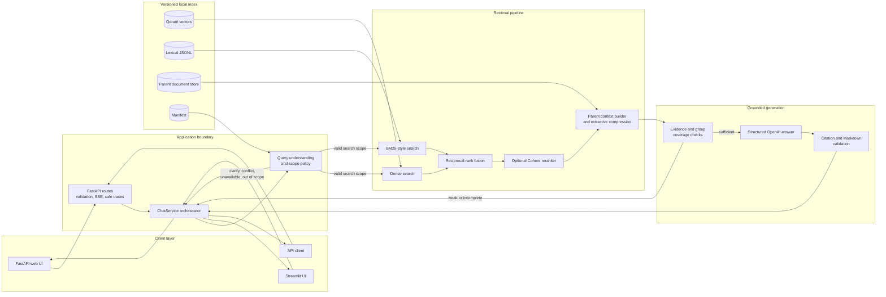
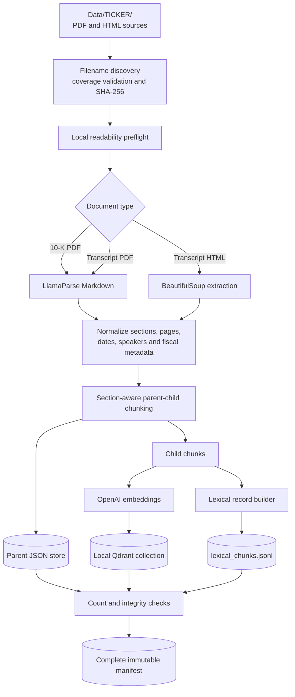
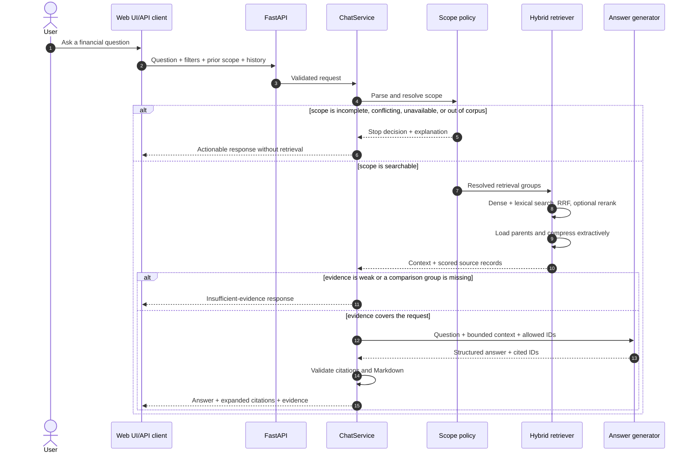

<div align="center">

# FinRAG Analyst

**Evidence-grounded financial research over SEC 10-K filings and Q4 earnings-call transcripts**

Python 3.11/3.12 · FastAPI · Streamlit · Qdrant · OpenAI · optional Cohere reranking

</div>

FinRAG is a retrieval-augmented generation (RAG) application built for financial
documents. It resolves the requested company, fiscal year, and evidence type before
search; combines semantic and exact-term retrieval; checks evidence coverage; and
returns a cited answer only when the indexed corpus can support it.

Unlike a general-purpose chatbot, FinRAG is intentionally bounded. It can ask for
missing scope, reject a conflicting filter, report an unavailable source, or abstain
when retrieval is weak.

> **Important:** FinRAG does not provide live market data or investment advice.
> Verify important conclusions against the cited filing or transcript.

## Contents

- [Manager presentation and project walkthrough](PROJECT_WALKTHROUGH.md)
- [Highlights](#highlights)
- [Bundled corpus and indexes](#bundled-corpus-and-indexes)
- [Quick start](#quick-start)
- [Architecture](#architecture)
- [Project workflows](#project-workflows)
- [Adding documents and building an index](#adding-documents-and-building-an-index)
- [API](#api)
- [Configuration](#configuration)
- [Project structure](#project-structure)
- [Testing and evaluation](#testing-and-evaluation)
- [Troubleshooting](#troubleshooting)
- [Known boundaries](#known-boundaries)

## Highlights

- **Two user interfaces:** a same-origin FastAPI web app and a Streamlit app use the
  same `ChatService` pipeline.
- **Scope-aware conversations:** company, fiscal year, and document type are parsed
  from the question, reconciled with UI filters, and inherited only for genuine
  follow-ups.
- **Hybrid retrieval:** OpenAI embeddings in local Qdrant are fused with a local
  BM25-style lexical index using reciprocal-rank fusion (RRF).
- **Optional reranking:** Cohere reranking can refine fused candidates and fails open
  to the original RRF order when disabled, unconfigured, or unavailable.
- **Parent-child indexing:** small child chunks improve retrieval precision while
  larger parent chunks preserve surrounding financial context.
- **Complete filing structures:** named tables and 10-K item lists are read from
  indexed parent records when a matching full structure is available, so ranked
  search cannot omit their rows.
- **Financial-safe compression:** context reduction is extractive and preserves
  tables, figures, units, dates, periods, and accounting qualifiers.
- **Coverage guardrails:** comparison answers require evidence for every requested
  company/year/document group.
- **Validated citations:** the model may cite only retrieved source IDs. Invalid
  output is retried; an invalid answer is withheld instead of showing raw excerpts.
- **Immutable indexes:** every index version has isolated Qdrant data, parent records,
  lexical records, and a reproducibility manifest.
- **Traceable operation:** safe API traces and local JSONL query logs expose routing
  and retrieval behavior without returning secrets or full prompts.

## Bundled corpus and indexes

The repository contains two ready-to-use immutable indexes:

| Index | Companies | Fiscal years | Evidence types | Sources | Child chunks |
|---|---|---|---|---:|---:|
| `phase1-v2` (default) | MSFT, TSLA | 2024, 2025 | 10-K, transcript | 8 | 1,493 |
| `phase1-v1` | JPM, MSFT, TSLA | 2024 | 10-K, transcript | 6 | 2,068 |

The source files currently under `Data/` correspond to `phase1-v2`. The older
`phase1-v1` index remains runnable from its own persisted index and manifest.

Coverage is index-specific. The application reads the selected index manifest and
rejects a request for a missing combination before retrieval.

## Quick start

Run all commands from this `finrag/` directory.

### 1. Create an environment

<details open>
<summary><strong>Windows PowerShell</strong></summary>

```powershell
py -3.12 -m venv .venv
.\.venv\Scripts\python.exe -m pip install --upgrade pip
.\.venv\Scripts\python.exe -m pip install -r requirements.txt
if (-not (Test-Path .env)) { Copy-Item .env.example .env }
```

</details>

<details>
<summary><strong>macOS or Linux</strong></summary>

```bash
python3.12 -m venv .venv
source .venv/bin/activate
python -m pip install --upgrade pip
python -m pip install -r requirements.txt
[ -f .env ] || cp .env.example .env

# The bundled indexes are stored under Data/ in this Windows-origin archive.
# Make the configured lowercase runtime path resolve to the same directory.
[ -e data ] || ln -s Data data
```

</details>

### 2. Configure the runtime

At minimum, add an OpenAI API key to `.env` and select a bundled index:

```dotenv
OPENAI_API_KEY=your_openai_api_key
FINRAG_INDEX_VERSION=phase1-v2
FINRAG_API_INDEX_VERSIONS=phase1-v2,phase1-v1
```

`OPENAI_API_KEY` is used for query embeddings and answer generation. Add
`LLAMA_CLOUD_API_KEY` only when parsing PDF files to build a new index. Cohere is
optional; see [Configuration](#configuration).

Never commit `.env`. It is already excluded by `.gitignore`.

### 3. Start an interface

The FastAPI app serves the production-style vanilla HTML/CSS/JavaScript frontend and
the API from one process:

```powershell
.\.venv\Scripts\python.exe -m uvicorn backend.main:app --host 127.0.0.1 --port 8000
```

Open <http://127.0.0.1:8000>. Health and catalogue endpoints are available at
<http://127.0.0.1:8000/api/health> and
<http://127.0.0.1:8000/api/catalogue>.

Alternatively, start Streamlit:

```powershell
.\.venv\Scripts\python.exe -m streamlit run app.py
```

On macOS/Linux, replace `.\.venv\Scripts\python.exe` with `python` after activating
the virtual environment.

### 4. Try a grounded question

- `Summarize Microsoft's 2024 risk factors from its 10-K.`
- `What did Tesla management say about automotive margins in its 2025 transcript?`
- `Compare Microsoft 2024 and 2025 revenue from the 10-Ks in a table.`
- `Compare Tesla's 2025 10-K discussion with its 2025 earnings call.`

## Architecture

### Runtime architecture



### Ingestion architecture



## Project workflows

### Question-answering workflow

This sequence shows the FastAPI path. Streamlit invokes `ChatService` directly and
then follows the same policy, retrieval, and generation stages.



The main decisions returned by the pipeline are `answered`, `clarify`,
`scope_conflict`, `data_unavailable`, `out_of_scope`, `insufficient_evidence`, and
`error`.

### Index-build workflow

1. Discover only filenames that match the supported corpus convention.
2. Validate company/year/type coverage and local readability.
3. Hash each source so the finished manifest identifies its exact input bytes.
4. Parse PDF layouts with LlamaParse or extract transcript HTML with BeautifulSoup.
5. Normalize source metadata without conflating fiscal year, comparative periods,
   filing page, or earnings-call date.
6. Split source segments into retrieval children and context-rich parents.
7. Embed children into a local Qdrant collection and write lexical child records.
8. Verify vector, lexical, and parent counts.
9. Write the manifest with source hashes, schema versions, model signature,
   dependencies, missing sources, and counts.

An index directory must be empty before a build. This prevents data created from
different source sets or schemas from being mixed accidentally.

## Adding documents and building an index

Place each source in `Data/<TICKER>/` using one of these exact filename forms:

```text
TICKER_YEAR_10K.pdf
TICKER_YEAR_TRANSCRIPT.pdf
TICKER_YEAR_TRANSCRIPT.html
```

For this phase, supported tickers are `JPM`, `MSFT`, and `TSLA`; supported fiscal
years are `2024` and `2025`.

Inspect the inventory without parsing, embedding, or modifying an index:

```powershell
.\.venv\Scripts\python.exe ingest_documents.py --index-version phase1-v3 --inventory-only
```

Build a new immutable index:

```powershell
.\.venv\Scripts\python.exe ingest_documents.py --index-version phase1-v3
```

Useful validation options:

```powershell
# Require all companies and both document types for one fiscal year
.\.venv\Scripts\python.exe ingest_documents.py --index-version phase1-v3 --inventory-only --require-complete-year 2025

# Require all 12 company/year/document-type combinations
.\.venv\Scripts\python.exe ingest_documents.py --index-version phase1-v3 --inventory-only --require-complete-corpus

# Build from another source directory
.\.venv\Scripts\python.exe ingest_documents.py --index-version phase1-v3 --data-dir C:\path\to\sources
```

PDF ingestion requires `LLAMA_CLOUD_API_KEY`; all real builds require
`OPENAI_API_KEY` for embeddings. When the build completes, change
`FINRAG_INDEX_VERSION` and, for FastAPI, `FINRAG_API_INDEX_VERSIONS` in `.env`.

Do not overwrite a populated version. Choose a new name when sources, parsers,
embeddings, dimensions, or chunk schemas change.

## API

The same-origin API exposes:

| Method | Path | Purpose |
|---|---|---|
| `GET` | `/api/health` | Process readiness and loaded-index count |
| `GET` | `/api/catalogue` | Allowed indexes and their source coverage |
| `POST` | `/api/chat` | One complete grounded response |
| `POST` | `/api/chat/stream` | SSE stage updates, heartbeats, and one final result |
| `GET` | `/api/openapi.json` | OpenAPI schema |

Example request:

```bash
curl -X POST http://127.0.0.1:8000/api/chat \
  -H "Content-Type: application/json" \
  -d '{
    "index_version": "phase1-v2",
    "question": "Compare Microsoft revenue in its 2024 and 2025 10-Ks.",
    "history": [],
    "previous_scope": {},
    "filters": {
      "company": "MSFT",
      "document_type": "10K"
    },
    "include_trace": false
  }'
```

The response contains the routing `decision`, grounded `answer`, resolved `scope`,
inherited fields, sanitized source metadata, evidence text, and request/trace IDs.
`/api/chat/stream` streams processing status rather than LLM tokens.

Full request/response behavior is documented in
[`README_FASTAPI.md`](README_FASTAPI.md).

## Configuration

### Required and commonly used settings

| Variable | Required | Default | Purpose |
|---|---|---|---|
| `OPENAI_API_KEY` | Runtime/build | — | Query/document embeddings and grounded answer generation |
| `LLAMA_CLOUD_API_KEY` | PDF ingestion | — | Layout-preserving PDF parsing |
| `FINRAG_INDEX_VERSION` | Yes | empty | Active index for Streamlit and default API index |
| `FINRAG_API_INDEX_VERSIONS` | API | active index | Comma-separated allowlist of indexes loaded by FastAPI |
| `FINRAG_LLM_MODEL` | No | `gpt-4o-mini` | Answer-generation model |
| `FINRAG_SEMANTIC_FALLBACK_ENABLED` | No | `false` | Enable bounded semantic clarification for unresolved/suspicious queries |
| `FINRAG_SEMANTIC_FALLBACK_MODEL` | No | answer model | Structured semantic-parser model |
| `FINRAG_SEMANTIC_FALLBACK_TIMEOUT_SECONDS` | No | `10` | Maximum semantic-parser request time |
| `FINRAG_MULTIHOP_ENABLED` | No | `false` | Enable bounded planning for compound comparison questions |
| `FINRAG_MULTIHOP_MAX_SEARCHES` | No | `4` | Maximum focused document searches in one plan |
| `FINRAG_MULTIHOP_MAX_CALCULATIONS` | No | `6` | Maximum deterministic calculations in one plan |
| `FINRAG_EMBEDDING_MODEL` | No | `text-embedding-3-small` | Embedding model; must match the index manifest |
| `FINRAG_EMBEDDING_DIMENSIONS` | No | `1536` | Vector size; must match the index manifest |
| `FINRAG_DEBUG_TRACES` | No | `false` | Enables UI diagnostics and allows sanitized API traces |
| `FINRAG_CORS_ORIGINS` | No | empty | Exact comma-separated origins for a separate trusted frontend |

### Retrieval controls

| Variable | Default | Purpose |
|---|---:|---|
| `FINRAG_DENSE_CANDIDATE_K` | `48` | Dense candidates before fusion |
| `FINRAG_LEXICAL_CANDIDATE_K` | `48` | Lexical candidates before fusion |
| `FINRAG_MAX_CONTEXT_PARENTS` | `8` | Maximum parent records in the model context |
| `FINRAG_MAX_CONTEXT_CHARS` | `48000` | Maximum context size in characters |
| `FINRAG_MIN_DENSE_SCORE` | `0.20` | Minimum accepted dense score |
| `FINRAG_MIN_LEXICAL_COVERAGE` | `0.20` | Minimum accepted lexical query coverage |
| `FINRAG_COMPRESSION_ENABLED` | `true` | Enable extractive parent compression |
| `FINRAG_COMPRESSION_KEEP_BLOCKS` | `6` | Minimum query-focused blocks retained per parent |

Thresholds are corpus-specific. Tune them against labeled questions rather than
treating the defaults as universal relevance values.

### Optional semantic fallback

The semantic fallback is disabled by default. When enabled, it runs at most once for
an unresolved scope, an unrecognized relative-period follow-up, or a suspicious
partial comparison. It receives only the question and bounded scope metadata. The
model may propose terminology or a candidate company, but deterministic policy still
validates the catalogue and asks for confirmation instead of applying uncertain
company/year filters.

```dotenv
FINRAG_SEMANTIC_FALLBACK_ENABLED=true
FINRAG_SEMANTIC_FALLBACK_MODEL=gpt-4o-mini
FINRAG_SEMANTIC_FALLBACK_TIMEOUT_SECONDS=10
```

Suggested terminology is searched only through a lower-priority lexical branch. The
original normalized query remains the dense, reranking, and compression query. If the
fallback fails, an existing clarification is preserved; suspicious company
comparisons fail closed and ask the user to confirm the companies.

Clarification replies are accumulated in a deterministic pending state that is
separate from confirmed conversation scope. Short replies can fill company, year,
and document type without losing earlier fields; retrieval and answer generation
continue to use the original financial question. A new substantive question or a
filter change clears the pending state.

### Optional multi-hop questions

Multi-hop orchestration is disabled by default so an existing deployment keeps its
current latency and model-call profile. Enable it after running the test suite and a
representative evaluation against the active index:

```dotenv
FINRAG_MULTIHOP_ENABLED=true
FINRAG_MULTIHOP_MAX_SEARCHES=4
FINRAG_MULTIHOP_MAX_CALCULATIONS=6
```

When enabled, simple questions, ordinary comparisons, and complete-table requests
retain the single-search path. Questions requesting arithmetic or multiple tasks
use a bounded structured plan. Each requirement searches one document type across
exact company/year groups.
Numeric requirements pass through extraction, normalization, and deterministic
source validation; calculations accept only validated fact IDs. Evidence from all
searches is deduplicated and assigned globally unique `S#` IDs. For calculated
comparisons, the application formats validated figures and arithmetic itself;
short narrative passages are included only when they match the cited source
verbatim. Missing groups, ambiguous facts, or unavailable calculations fail
closed. If only the requested explanation is unsupported, the response keeps
the verified calculations and explicitly marks the explanation incomplete.

Primary-statement HTML rows already in the parent chunks can recover omitted
numeric facts. Consolidated totals take precedence over segment rows, and a
verified table row takes precedence over inconsistent model-supplied metadata.

Run the five indexed comparison checks with:

```powershell
.\.venv\Scripts\python.exe evals\smoke_multihop.py --verdict
```

This uses the existing parent chunks, including embedded Markdown/HTML tables. It
does not require re-ingestion, SQLite, a separate table index, or a table-search tool.

Complete named tables and 10-K item lists use a smaller direct path: after scope
resolution, the app scans matching indexed parent records for a table heading
matching the requested subject, or derives the item list from metadata. The
matching full structure is displayed with source links. When no matching full
structure is available, the question continues through hybrid search, optional
reranking, compression, and generation.
For a single 10-K filing, reported figures in statement rows are read from the
indexed row and year column and supplied to generation with their source. A
generated amount that conflicts with these verified cells is retried and then
withheld if still wrong. Multi-hop calculations use the same indexed rows as a
fallback when ranked search misses a required statement parent.
LangGraph is not needed for this bounded routing; adding it would not change the
retrieved evidence or repair a truncated source table.

### Optional Cohere reranking

```dotenv
FINRAG_RERANK_ENABLED=true
COHERE_API_KEY=your_cohere_api_key
FINRAG_RERANK_MODEL=rerank-v4.0-fast
FINRAG_RERANK_CANDIDATE_K=20
FINRAG_RERANK_TOP_N=5
FINRAG_RERANK_MIN_PER_GROUP=2
FINRAG_RERANK_TIMEOUT_SECONDS=12
FINRAG_RERANK_RETRIES=1
```

When reranking is disabled, has no API key, or its request fails, FinRAG continues
with the dense + lexical + RRF order.

## Project structure

```text
finrag/
├── backend/
│   ├── main.py                    FastAPI routes, SSE, middleware, static UI
│   ├── models.py                  strict public request/response contracts
│   └── service_manager.py         lifespan-owned index services
├── frontend/
│   ├── index.html                 accessible web shell
│   ├── app.js                     chat, filters, history, SSE, evidence UI
│   └── styles.css                 responsive light/dark presentation
├── src/
│   ├── app/chat_service.py        end-to-end policy/retrieval/generation orchestration
│   ├── generation/                prompts, LLM, citations, output guardrails
│   ├── ingestion/                 inventory, loaders, cache, chunking, stores
│   ├── retrieval/                 query scope, hybrid search, reranking, context
│   ├── config.py                  environment and versioned paths
│   ├── constants.py               supported corpus vocabulary and schemas
│   └── schemas.py                 shared typed contracts
├── Data/
│   ├── MSFT/ and TSLA/            current source documents
│   ├── indexes/<version>/         Qdrant, parents, lexical records, manifest
│   └── logs/query_traces.jsonl    local request traces
├── evals/                         RAGAS dataset, runner, audit, and results
├── tests/                         deterministic regression tests
├── app.py                         Streamlit entry point
├── ingest_documents.py            immutable index builder
├── evaluate.py                    routing-policy evaluation for a CSV suite
├── requirements.txt               runtime dependencies
└── requirements-eval.txt          optional evaluation dependencies
```

Each persisted index has this shape:

```text
Data/indexes/<version>/
├── manifest.json
├── lexical_chunks.jsonl
├── parents/*.json
└── qdrant/
```

On case-sensitive systems the configured runtime path is `data/`; keep source and
runtime directory casing consistent when moving this project between platforms.

## Testing and evaluation

Run deterministic unit and API tests:

```powershell
.\.venv\Scripts\python.exe -m pytest -q
.\.venv\Scripts\python.exe -m compileall -q backend src tests
.\.venv\Scripts\python.exe -m pip check
```

FastAPI tests inject a fake `ChatService`, so they do not call OpenAI, Cohere,
LlamaParse, or the persisted vector stores.

Validate the RAGAS gold dataset without making model calls:

```powershell
.\.venv\Scripts\python.exe evals\evaluate_ragas.py --validate-only
```

Run an end-to-end RAGAS evaluation:

```powershell
.\.venv\Scripts\python.exe -m pip install -r requirements-eval.txt
.\.venv\Scripts\python.exe evals\evaluate_ragas.py --index-version phase1-v2
```

The live evaluation executes `ChatService.ask`, saves checkpoints under
`evals/results/`, and reports faithfulness, context precision, context recall,
response relevancy, factual correctness, answer success, and scope-match rates.

To evaluate only routing policy against your own CSV suite:

```powershell
.\.venv\Scripts\python.exe evaluate.py --suite path\to\eval_questions.csv
```

## Troubleshooting

### `No index version selected`

Set `FINRAG_INDEX_VERSION=phase1-v2` in `.env`, or pass an explicit version to
ingestion and evaluation commands.

### `Index ... does not exist` or manifest/count mismatch

Confirm the version exists under `Data/indexes/` (or `data/indexes/` on a
case-sensitive system), that its manifest status is `complete`, and that the Qdrant,
parent, and lexical files were moved together.

### Missing API key

- Normal querying requires `OPENAI_API_KEY`.
- Rebuilding an index from PDFs also requires `LLAMA_CLOUD_API_KEY`.
- Cohere requires `COHERE_API_KEY` only when optional reranking is enabled.

Restart the app after editing `.env`; settings are loaded at process startup.

### Reranker warning with no Cohere key

This is non-fatal. Set `FINRAG_RERANK_ENABLED=false`, or provide a Cohere key. The
retriever will otherwise use its RRF ordering.

### PowerShell blocks environment activation

Activation is optional. Invoke `.\.venv\Scripts\python.exe` directly, as shown in
the commands above.

### A question is rejected before search

This is expected when the scope is incomplete, a filter conflicts with explicit
question text, a requested source is absent from the selected index, or the question
requires live/external information. Select a compatible index or make the company,
fiscal year, and evidence basis explicit.

## Known boundaries

- The supported vocabulary is intentionally limited to JPM, MSFT, TSLA, 2024, 2025,
  10-K filings, and Q4 transcripts.
- Answers come from the selected immutable index, not the public web, market feeds,
  or databases.
- The API's SSE endpoint emits workflow stages and heartbeats, not token-by-token LLM
  output.
- A disconnected SSE client cannot forcibly stop synchronous work already running in
  a worker thread.
- Local browser history and theme preferences live in `localStorage`; the backend
  does not provide user accounts or persistent conversation storage.
- Phase 1 does not include autonomous agents, SQL tools, or live financial-data
  connectors. Its calculator is limited to validated retrieved figures.
- No software license is currently included in this repository. Add one before public
  redistribution.

## Design principles

1. **Scope before search.** Retrieval never guesses silently across companies or
   fiscal years.
2. **Evidence before prose.** Weak or incomplete evidence produces an abstention, not
   a polished unsupported answer.
3. **Preserve financial meaning.** Tables, units, dates, reported periods, and
   qualifiers survive context construction.
4. **Citations are data.** Source IDs are validated against retrieved records and
   expanded into readable provenance.
5. **Indexes are reproducible artifacts.** Source hashes, schemas, models, counts, and
   dependency versions travel together in the manifest.
